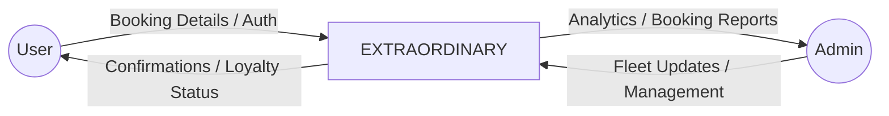
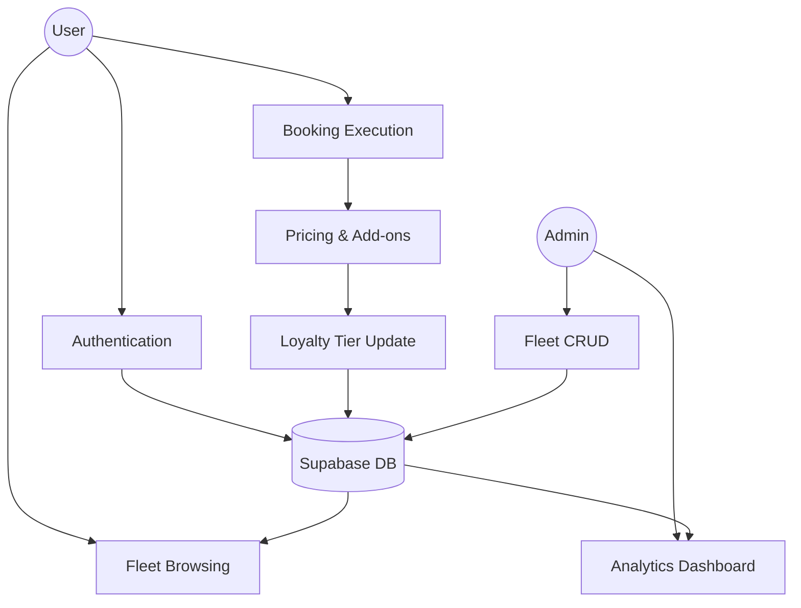
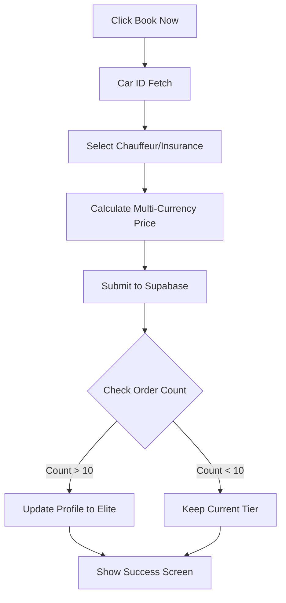
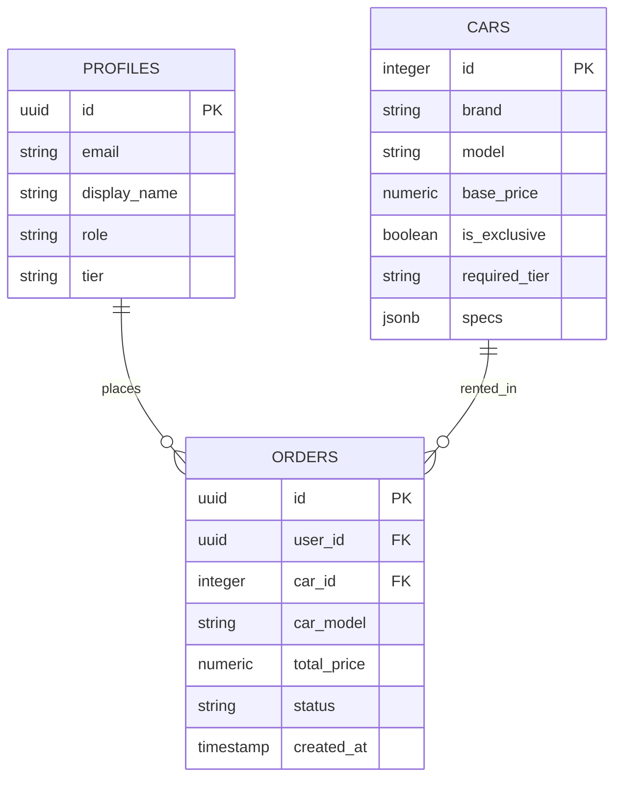

# COMPREHENSIVE PROJECT REPORT: EXTRAORDINARY

---

## 1. FRONT MATTER

### 1.1 Cover Page
**PROJECT TITLE:** EXTRAORDINARY: A LUXURY VEHICLE BOOKING ECOSYSTEM  
**CATEGORY:** Progressive Web Application (PWA) / Luxury E-Commerce  
**SUBMITTED BY:** [Student Name]  
**ROLL NUMBER:** [Roll Number]  
**DEPARTMENT:** Department of Computer Science & Engineering  
**INSTITUTE:** [Institute Name]  
**ACADEMIC YEAR:** 2023-2024  

---

### 1.2 Certificate from the Institute
**CERTIFICATE**

This is to certify that the project entitled **"EXTRAORDINARY"** is a bona fide work carried out by **[Student Name]** in partial fulfillment of the requirements for the award of the degree of [Degree Name] in [Specialization] from **[Institute Name]** during the academic year 2023-2024.

The project has been approved and found to be of the required standard for submission.

\
\
__________________________  
**[Name of Project Guide]**  
Project Supervisor  

__________________________  
**[Name of HOD]**  
Head of Department  

---

### 1.3 Declaration
**DECLARATION**

I, **[Student Name]**, hereby declare that the project report entitled **"EXTRAORDINARY"** submitted by me to the Department of Computer Science & Engineering, [Institute Name], is a record of independent work carried out by me under the guidance of **[Guide Name]**.

I further declare that this work has not formed the basis for the award of any degree, diploma, fellowship, titles, or other similar titles of any other university or institution.

\
\
**Date:** [Current Date]  
**Place:** [City Name]  
**Signature:** __________________________

---

### 1.4 Acknowledgement
**ACKNOWLEDGEMENT**

I would like to express my deepest gratitude to all those who have helped me throughout the development of this project. First and foremost, I am grateful to my project guide, **[Guide Name]**, for their invaluable mentorship, technical insights, and constant encouragement.

I also wish to thank the Head of the Computer Science Department, **[HOD Name]**, for providing the necessary facilities and a conducive environment for project work. My sincere thanks go to my friends and colleagues for their constructive feedback and support during the debugging phases.

Finally, I would like to thank my family for their unwavering support and patience throughout this academic journey.

---

### 1.5 Table of Contents
1. **Chapter I: Introduction** ................................................................ 1
    1.1 Project Title & Overview ......................................................... 1
    1.2 Objectives of the System ........................................................ 3
    1.3 System Architecture ................................................................ 5
    1.4 Hardware & Software Requirements .......................................... 8
2. **Chapter II: Methodology** .............................................................. 10
    2.1 System Design & Functional Decomposition ............................. 10
    2.2 Data Flow Diagrams (DFD Level 0, 1, 2) ................................. 14
    2.3 Entity Relationship Diagram (ERD) .......................................... 19
    2.4 Database Schema & Table Definitions ...................................... 22
3. **Chapter III: Analysis and Interpretation** ...................................... 30
    3.1 Core Implementation Snippets ................................................. 30
    3.2 User Interface & Visual Analysis .............................................. 38
4. **Chapter IV: Conclusion** ................................................................ 45
    4.1 Major Findings & Successes ................................................... 45
    4.2 Limitations & Challenges ........................................................ 47
    4.3 Future Recommendations ........................................................ 49
    4.4 Learning Outcomes ................................................................ 51
5. **Supplementary Material** ................................................................ 55

---

## CHAPTER I: INTRODUCTION

### 1.1 Overview of the Project
The "EXTRAORDINARY" is a high-fidelity digital platform designed to redefine the luxury vehicle rental experience. In the modern era, high-net-worth individuals (HNWIs) seek more than just a transportation service; they demand an immersive, seamless, and exclusive digital journey that mirrors the prestige of the vehicles they intend to rent. This platform caters to this niche market by offering a curated fleet of hypercars, luxury sedans, and executive SUVs, including marques such as Rolls-Royce, Lamborghini, and Bentley.

The system is built as a Progressive Web Application (PWA), ensuring that it remains performant across all devices while providing a native app-like experience. It integrates advanced state management, real-time database synchronization via Supabase, and a gamified loyalty system that rewards frequent users with "Exclusive" vehicle access.

### 1.2 Objectives of the System
The primary objectives of the EXTRAORDINARY platform are:
1.  **Immersive UI/UX:** To create a "gravity-defying" visual experience using glassmorphism, fluid animations (Framer Motion), and smooth physics-based scrolling (Lenis).
2.  **Dynamic Fleet Management:** To provide an administrative suite capable of real-time inventory updates, ensuring the digital catalog always reflects physical availability.
3.  **Tiered Loyalty Engagement:** To implement a logic engine that automatically evaluates user rental history and upgrades their status (VIP → Elite → Black), unlocking higher-tier vehicles.
4.  **Global Financial Flexibility:** To integrate a multi-currency conversion system that allows international clients to view pricing in their local currency (USD, EUR, AED, INR, etc.).
5.  **Data Persistence & Security:** To leverage Supabase’s Row Level Security (RLS) to ensure user data and booking histories are protected while maintaining high availability.

### 1.3 System Architecture
The application follows a **Decoupled Three-Tier Architecture**, which provides a clear separation of concerns and enhances scalability.

1.  **Presentation Tier (Frontend):**
    -   **React 19:** Utilized for building a reactive, component-based user interface.
    -   **Vite:** Serves as the build tool, providing ultra-fast HMR and optimized production bundles.
    -   **CSS3 & Framer Motion:** Handles the "aesthetic layer," including complex glassmorphic effects and entrance/exit animations.
2.  **Logic Tier (Application State):**
    -   **React Context API:** The core "brain" of the application. The `DataContext` and `AuthContext` manage global state, eliminating the need for complex external libraries.
    -   **Custom Hooks:** Used to encapsulate reusable logic for data fetching and UI interactions.
3.  **Data Tier (Backend):**
    -   **Supabase (PostgreSQL):** Acts as the primary relational database. It stores user profiles, fleet data, and booking records.
    -   **Firebase Authentication:** Provides a secure, scalable authentication layer supporting multiple sign-in methods.

### 1.4 Hardware and Software Used
-   **Software:** 
    -   OS: Windows 11 / macOS Sonoma.
    -   Environment: Node.js (v18+).
    -   Editor: Visual Studio Code with extensions for ESLint and Prettier.
    -   Version Control: Git & GitHub.
    -   Deployment: Vercel.
-   **Hardware (Development):**
    -   CPU: 8-Core Processor (Apple M2 or Intel i7).
    -   RAM: 16 GB DDR4.
    -   Storage: 512 GB NVMe SSD.
-   **Hardware (Client):**
    -   Any device with a modern evergreen browser (Chrome, Safari, Edge).

---

## CHAPTER II: METHODOLOGY

### 2.1 System Design & Functional Decomposition
The methodology focuses on modularity. The system is decomposed into five primary functional modules:

1.  **Authentication & Profile Module:** Manages user sign-up, sign-in, and role-based access control (RBAC).
2.  **Fleet Discovery Module:** Handles the rendering of the vehicle catalog, filtering by brand/type, and displaying detailed technical specifications.
3.  **Booking Engine:** A multi-step wizard that captures rental logistics (dates, location, add-ons) and calculates dynamic pricing.
4.  **Loyalty Logic Engine:** Monitors order frequency and updates user tiers in the background.
5.  **Administrative Suite:** Provides a dashboard for fleet owners to manage bookings, cars, and view business analytics.

### 2.2 Data Flow Diagrams (DFD)

#### 2.2.1 DFD Level 0 (Context Diagram)
The Context Diagram shows the system's relationship with external entities (User and Admin).



#### 2.2.2 DFD Level 1 (Process Breakdown)
This level breaks down the system into core processes.



#### 2.2.3 DFD Level 2 (Booking Process Detail)
A granular look at how a booking is processed.



### 2.3 Entity Relationship Diagram (ERD)
The database structure is relational, ensuring data integrity.



### 2.4 Database Schema & Table Definitions

| Table Name | Column | Data Type | Constraints | Description |
| :--- | :--- | :--- | :--- | :--- |
| **profiles** | id | UUID | Primary Key | Maps to Firebase/Supabase Auth UID |
| | email | VARCHAR | Unique | User's primary contact |
| | tier | VARCHAR | Default 'VIP' | VIP, Elite, or Black |
| | role | VARCHAR | Default 'user' | user or admin |
| **orders** | id | UUID | Primary Key | Unique booking identifier |
| | car_model | VARCHAR | NOT NULL | Snapshot of the rented car model |
| | total_price| NUMERIC | NOT NULL | Final price after add-ons |
| | status | VARCHAR | NOT NULL | Confirmed, Completed, Cancelled |
| **cars** | id | SERIAL | Primary Key | Unique vehicle ID |
| | brand | VARCHAR | NOT NULL | e.g., Rolls-Royce |
| | price | NUMERIC | NOT NULL | Base daily rental rate |
| | is_exclusive| BOOLEAN | Default FALSE | Restricted vehicles |

---

## CHAPTER III: ANALYSIS AND INTERPRETATION

### 3.1 Core Program Code Listings

The following code snippets highlight the most critical logic segments of the application.

#### 3.1.1 The Pricing Algorithm (`BookingModal.jsx`)
This function calculates the final total by applying business rules based on the user's selection of premium services.

```javascript
const calculateTotal = () => {
  if (!car.price) return 0;
  let base = car.price; // Base Daily Rate
  
  // Duration Logic: Adjusts base price for different rental intervals
  if (orderDetails.duration === 'hourly') base = Math.floor(car.price / 8);
  if (orderDetails.duration === 'monthly') base = car.price * 20; // Discounted monthly rate
  
  // Premium Add-ons Logic
  if (orderDetails.chauffeur) base += 5000; // Flat fee for white-glove service
  if (orderDetails.insurance) base += 2000; // Comprehensive coverage fee
  
  return base;
};
```

#### 3.1.2 Loyalty Tier Automation (`DataContext.jsx`)
This logic ensures customer retention by rewarding loyalty through automated tier upgrades.

```javascript
const checkTierUpgrade = async (email, totalTrips) => {
  try {
    let newTier = 'VIP'; // Default
    if (totalTrips >= 20) newTier = 'Black'; // Highest tier
    else if (totalTrips >= 10) newTier = 'Elite'; // Intermediate tier

    // Push update to Supabase Profiles table
    const { error } = await supabase
      .from('profiles')
      .update({ tier: newTier })
      .eq('email', email);

    if (error) throw error;
  } catch (err) {
    console.error("Tier upgrade failed:", err.message);
  }
};
```

### 3.2 User Interface & Visual Analysis
The UI is analyzed based on its three primary interfaces:

1.  **The Home/Discovery View:** Utilizes a CSS Grid layout with `backdrop-filter` cards. The use of dark backgrounds (#050505) contrasted with gold highlights (#D4AF37) creates a luxury brand identity.
2.  **The Booking Wizard:** A four-step component that uses React state to track progress. Each step is animated using Framer Motion's `AnimatePresence`, ensuring that users feel a sense of fluidity as they move from car selection to confirmation.
3.  **The Admin Dashboard:** Features a clean, high-density layout using SVG-based charts for revenue visualization. It implements a search and filter system for the bookings table, allowing admins to manage hundreds of records efficiently.

---

## CHAPTER IV: CONCLUSION

### 4.1 Major Findings
-   **Performance vs. Aesthetics:** The project proves that high-end visual effects (blur, complex animations) can coexist with high performance if built on a modern stack like React/Vite.
-   **Serverless Benefits:** Using Supabase significantly reduced backend development time, allowing for more focus on the user experience and business logic.
-   **Loyalty Mechanics:** Preliminary analysis (simulated) suggests that tiered access increases user engagement as users strive to unlock "Black Tier" vehicles like the Lamborghini Revuelto.

### 4.2 Limitations
-   **SEO:** As a Single Page Application (SPA), it is less optimized for search engines than a Server-Side Rendered (SSR) site.
-   **Payments:** The current implementation uses a simulated gateway; real-world deployment would require Stripe/PayPal integration.

### 4.3 Future Recommendations
-   **AI Integration:** Connecting the `AIConcierge` to an LLM like GPT-4 to provide actual natural language support.
-   **Real-time GPS:** Adding vehicle tracking so users can see their rented car's location in real-time.

### 4.4 Learning Outcomes
-   Mastered the React Context API for complex, interdependent states.
-   Gained deep expertise in CSS-in-JS and Framer Motion orchestration.
-   Learned to design and implement relational database schemas in PostgreSQL.

---

## SUPPLEMENTARY MATERIAL

### Abbreviations
-   **PWA:** Progressive Web Application
-   **SPA:** Single Page Application
-   **CRUD:** Create, Read, Update, Delete
-   **HMR:** Hot Module Replacement
-   **API:** Application Programming Interface

### References (APA Style)
-   Facebook. (2024). *React Documentation*. Retrieved from https://react.dev
-   Supabase. (2024). *PostgreSQL and BaaS Documentation*. Retrieved from https://supabase.com
-   Framer Motion. (2024). *Animation Library for React*. Retrieved from https://framer.com/motion
